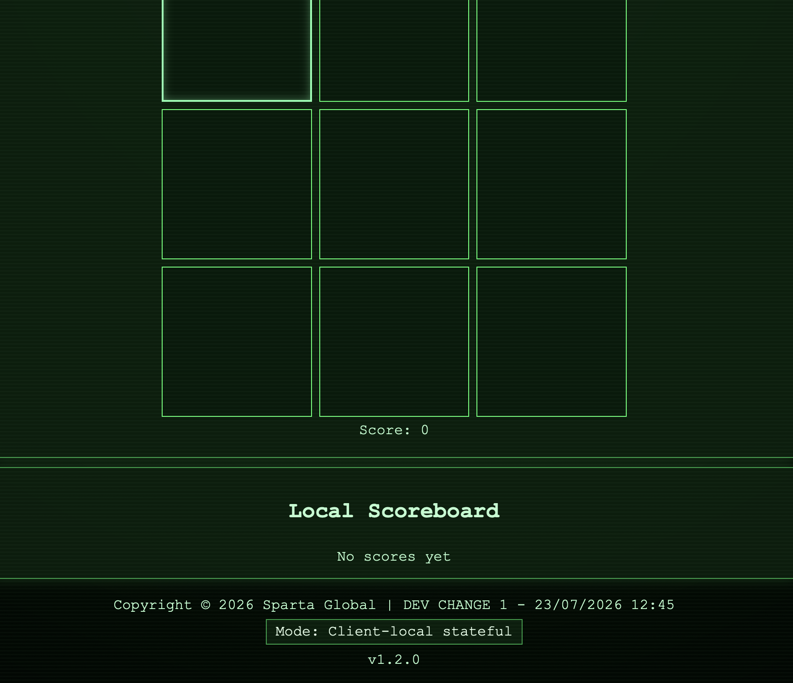

# 3-Job CI/CD Pipeline

## Table of Contents

- [3-Job CI/CD Pipeline](#3-job-cicd-pipeline)
  - [Table of Contents](#table-of-contents)
  - [1. Overview](#1-overview)
    - [Objectives](#objectives)
  - [2. Pipeline Architecture](#2-pipeline-architecture)
    - [Why the Pipeline Was Designed This Way](#why-the-pipeline-was-designed-this-way)
  - [3. Prerequisites](#3-prerequisites)
    - [Repository Structure](#repository-structure)
  - [4. Job 1 — Test](#4-job-1--test)
    - [Purpose](#purpose)
    - [Process](#process)
    - [Why testing comes first](#why-testing-comes-first)
    - [Expected Outcome](#expected-outcome)
    - [Job 1 Setup](#job-1-setup)
    - [Job 1 Setup](#job-1-setup-1)
      - [Step 1 — Create the Jenkins Job](#step-1--create-the-jenkins-job)
      - [Step 2 — Configure the GitHub Repository](#step-2--configure-the-github-repository)
      - [Step 3 — Configure the GitHub Trigger](#step-3--configure-the-github-trigger)
      - [Step 4 — Configure the Test](#step-4--configure-the-test)
  - [5. Job 2 — Merge](#5-job-2--merge)
    - [Purpose](#purpose-1)
    - [Process](#process-1)
    - [Git Branching](#git-branching)
    - [Job 2 Setup](#job-2-setup)
  - [6. Job 3 — Deploy](#6-job-3--deploy)
    - [Purpose](#purpose-2)
    - [Process](#process-2)
    - [Job 3 Setup and Authentication](#job-3-setup-and-authentication)
    - [Job 3 Setup and Authentication](#job-3-setup-and-authentication-1)
      - [Step 1 — Create Job 3](#step-1--create-job-3)
      - [Step 2 — Configure the Repository](#step-2--configure-the-repository)
      - [Step 3 — Configure the Trigger](#step-3--configure-the-trigger)
      - [Step 4 — Configure SSH Authentication](#step-4--configure-ssh-authentication)
      - [Step 5 — Configure the EC2 Instance](#step-5--configure-the-ec2-instance)
      - [Step 6 — Transfer the Application](#step-6--transfer-the-application)
      - [Step 7 — Execute Shell Commands](#step-7--execute-shell-commands)
      - [Step 7 — Configure the Execute Shell](#step-7--configure-the-execute-shell)
      - [Step 8 — Save and Test Job 3](#step-8--save-and-test-job-3)
      - [Expected Result](#expected-result)
  - [7. GitHub Webhook](#7-github-webhook)
    - [Webhook Setup](#webhook-setup)
    - [Webhook Setup](#webhook-setup-1)
      - [Step 1 — Open the GitHub Repository Settings](#step-1--open-the-github-repository-settings)
      - [Step 2 — Configure the Payload URL](#step-2--configure-the-payload-url)
      - [Step 3 — Configure the Content Type](#step-3--configure-the-content-type)
      - [Step 4 — Select the Trigger Event](#step-4--select-the-trigger-event)
      - [Step 5 — Enable the Jenkins GitHub Trigger](#step-5--enable-the-jenkins-github-trigger)
      - [Step 6 — Test the Webhook](#step-6--test-the-webhook)
      - [Step 7 — Configure the Execute Shell](#step-7--configure-the-execute-shell-1)
  - [8. AWS EC2 Deployment](#8-aws-ec2-deployment)
    - [Deployment Flow](#deployment-flow)
  - [9. Pipeline Flow](#9-pipeline-flow)
    - [End-to-End Workflow](#end-to-end-workflow)
  - [10. Testing and Results](#10-testing-and-results)
    - [First Successful Deployment](#first-successful-deployment)
    - [Second Successful Deployment](#second-successful-deployment)
    - [Testing Process](#testing-process)
  - [11. Benefits of the CI/CD Pipeline](#11-benefits-of-the-cicd-pipeline)
    - [Benefits Observed](#benefits-observed)
    - [Benefits for an Organisation](#benefits-for-an-organisation)

## 1. Overview

This document explains the implementation of a 3-job Continuous Integration and Continuous Deployment (CI/CD) pipeline using Jenkins, GitHub and AWS EC2.

The pipeline automates the process of taking changes made to the application, testing them, merging approved changes into the main branch, and deploying the updated application to an AWS EC2 instance.

The pipeline consists of three Jenkins jobs:

- **Job 1 — Test:** Retrieves the application code and runs automated tests.
- **Job 2 — Merge:** Runs after successful testing and merges the development branch into the main branch.
- **Job 3 — Deploy:** Transfers the tested application from Jenkins to an AWS EC2 instance and starts/restarts the application.

A GitHub webhook is used to notify Jenkins when changes are pushed to the repository, allowing the pipeline to be triggered automatically.

### Objectives

The main objectives of this pipeline are to:

- Automate application testing.
- Ensure only tested code is merged into the main branch.
- Automate deployment to an AWS EC2 instance.
- Reduce manual steps between development and deployment.
- Demonstrate the principles of Continuous Integration and Continuous Deployment.
## 2. Pipeline Architecture

The CI/CD pipeline connects GitHub, Jenkins and AWS EC2. Each stage has a specific responsibility, allowing code to be tested, merged and deployed in a controlled sequence.

```text
Developer
    │
    │ Pushes changes
    ▼
GitHub Repository
    │
    │ GitHub Webhook
    ▼
Jenkins Job 1
    │
    │ Run tests
    │
    ├── Tests fail ──► Pipeline stops
    │
    ▼
Jenkins Job 2
    │
    │ Merge dev → main
    ▼
Jenkins Job 3
    │
    │ Copy tested application
    │ via SSH/SCP
    ▼
AWS EC2 Instance
    │
    │ Start/restart application
    ▼
Running Application
```
### Why the Pipeline Was Designed This Way

The pipeline was separated into three Jenkins jobs so that testing, merging and deployment each had a clear responsibility.

Job 1 acts as a quality gate by testing changes before they can progress further. Job 2 only merges code from `dev` into `main` after the tests have passed. Job 3 then handles deployment to AWS EC2.

This creates a controlled flow:

`Test → Merge → Deploy`

Separating the stages makes it easier to identify where a failure has occurred and prevents failed or untested code from automatically reaching the deployed environment.
## 3. Prerequisites

The following tools and services were required to build and run the CI/CD pipeline.

| Tool / Service | Purpose |
|---|---|
| Git | Used for version control and managing branches locally. |
| GitHub | Used to host the application repository and manage the development and main branches. |
| Jenkins | Used to automate testing, merging and deployment. |
| GitHub Webhook | Used to automatically notify Jenkins when changes are pushed. |
| AWS EC2 | Used to host the deployed application. |
| SSH | Used by Jenkins to securely connect to the EC2 instance. |
| SCP / Rsync | Used to transfer the tested application from Jenkins to the EC2 instance. |
| Node.js / npm | Used to install dependencies and run the application on the EC2 instance. |

### Repository Structure

The application was stored in a GitHub repository with separate development and main branches.

The development branch was used for making changes and testing new functionality. Once the tests passed successfully, Jenkins merged the changes into the main branch.

This provided a simple workflow for controlling which code was considered ready for deployment.
## 4. Job 1 — Test

The first Jenkins job is responsible for testing the application before any changes are merged into the main branch or deployed to AWS.

### Purpose

The purpose of Job 1 is to provide an automated quality check. If the tests fail, the pipeline should stop so that untested or broken code is not merged or deployed.

### Process

The job performs the following steps:

1. Jenkins retrieves the application code from the GitHub repository.
2. The required dependencies are installed.
3. The application's automated tests are executed.
4. Jenkins reports whether the tests passed or failed.
5. If the tests pass, the pipeline can continue to Job 2.
6. If the tests fail, the pipeline stops and the code is not merged or deployed.

### Why testing comes first

Testing is placed at the beginning of the pipeline so that problems can be identified before the code reaches the main branch or production environment.

This follows the Continuous Integration principle of integrating and testing changes frequently.

### Expected Outcome

A successful Job 1 execution should show a successful Jenkins build and passing tests.

If the tests fail, the build should be marked as failed and the subsequent jobs should not proceed.
### Job 1 Setup

### Job 1 Setup

Job 1 was created as a Jenkins Freestyle project and configured to test changes pushed to the `dev` branch.

#### Step 1 — Create the Jenkins Job

1. From the Jenkins dashboard, select **New Item**.
2. Enter a name for the job, for example:
   `hasanah-ttt-job1-ci-test`
3. Select **Freestyle project**.
4. Select **OK** to create the job.

#### Step 2 — Configure the GitHub Repository

1. Under **Source Code Management**, select **Git**.
2. Enter the HTTPS or SSH URL of the GitHub repository.
3. Select the appropriate Jenkins GitHub credentials.
4. Under **Branches to build**, configure the development branch:

   `*/dev`

This ensures that Job 1 tests changes from the development branch rather than the main branch.

#### Step 3 — Configure the GitHub Trigger

Under **Build Triggers**, enable:

`GitHub hook trigger for GITScm polling`

This allows a GitHub webhook to automatically trigger Job 1 when changes are pushed to the repository.

#### Step 4 — Configure the Test

Under **Build Steps**, select **Execute shell**.

The application dependencies and tests can then be executed from the Jenkins workspace.

For the Node.js application, the build commands used were:

```bash
npm install
npm test
```
## 5. Job 2 — Merge

The second Jenkins job is responsible for merging tested changes from the development branch into the main branch.

### Purpose

The purpose of Job 2 is to ensure that only code which has successfully passed the testing stage is merged into the main branch.

This provides an additional level of control between development and deployment.

### Process

The job performs the following steps:

1. Job 2 is triggered after Job 1 completes successfully.
2. Jenkins checks that the tests from Job 1 have passed.
3. The changes from the development branch are merged into the main branch.
4. Jenkins pushes the updated main branch back to the GitHub repository.
5. If the merge is successful, the pipeline can continue to Job 3.

If Job 1 fails, Job 2 should not run because the code has not passed the testing stage.

### Git Branching

The pipeline uses two main branches:

- **dev** — used for developing and testing changes.
- **main** — contains the tested code that is ready for deployment.

The workflow can therefore be represented as:

```text
dev branch
    │
    │ Changes pushed
    ▼
Job 1 — Test
    │
    │ Tests pass
    ▼
Job 2 — Merge
    │
    │ dev → main
    ▼
main branch
```
### Job 2 Setup

Job 2 was configured to run only after Job 1 completed successfully.

The Jenkins **Git Publisher** plugin was configured within the **Post-build Actions** section. This allowed Jenkins to push the successfully tested changes from the `dev` branch into the `main` branch.

Using Git Publisher automated the merge stage and removed the need for the developer to manually merge successfully tested changes.

Authentication to GitHub was managed through Jenkins credentials so that repository credentials did not need to be stored directly within the application code.
## 6. Job 3 — Deploy

The third Jenkins job is responsible for deploying the tested and merged application to an AWS EC2 instance.

### Purpose

The purpose of Job 3 is to automate the deployment of the application after the code has successfully passed testing and been merged into the main branch.

This removes the need to manually transfer the application and start it on the EC2 instance.

### Process

The job performs the following steps:

1. Job 3 runs after Job 2 completes successfully.
2. Jenkins prepares the updated application files.
3. Jenkins connects securely to the AWS EC2 instance using SSH.
4. The updated application files are transferred from Jenkins to the EC2 instance.
5. Dependencies are installed or updated using npm.
6. The application is started or restarted on the EC2 instance.
7. The updated application becomes available through the EC2 instance.

The deployment flow is:

```text
Job 2 — Merge
      │
      │ Successful merge
      ▼
Job 3 — Deploy
      │
      │ SSH connection
      ▼
AWS EC2
      │
      │ Transfer application
      ▼
Install dependencies
      │
      ▼
Start / restart application
      │
      ▼
Updated application
```
### Job 3 Setup and Authentication

### Job 3 Setup and Authentication

Job 3 was created as a Jenkins Freestyle project responsible for transferring the tested application from the Jenkins workspace to AWS EC2 and starting or restarting the application.

Unlike a deployment that performs a `git clone` directly on the production server, this pipeline transfers the application files that have progressed through the Jenkins pipeline.

#### Step 1 — Create Job 3

1. From the Jenkins dashboard, select **New Item**.
2. Enter a name for the deployment job, for example:
   `hasanah-ttt-job3-cd-deploy`
3. Select **Freestyle project**.
4. Select **OK**.

#### Step 2 — Configure the Repository

Under **Source Code Management**, select **Git** and enter the GitHub repository URL.

Configure Jenkins to use the appropriate repository credentials.

Job 3 uses the tested application code that has successfully progressed through the previous stages of the pipeline.

#### Step 3 — Configure the Trigger

Configure Job 3 so that it only executes after Job 2 completes successfully.

This ensures that deployment only takes place after:

1. Job 1 has successfully tested the application.
2. Job 2 has successfully merged/published the tested code.
3. Job 3 is then allowed to deploy it.

#### Step 4 — Configure SSH Authentication

Jenkins requires SSH access to the AWS EC2 instance.

The EC2 private key was stored securely using **Jenkins Credentials** rather than being placed inside the GitHub repository.

The credentials were then made available to the deployment job so that Jenkins could authenticate with the EC2 instance.

The EC2 security group also needed to allow SSH traffic on:

`TCP port 22`

from the Jenkins server.

#### Step 5 — Configure the EC2 Instance

The EC2 instance was prepared with the software required to run the application, including:

- Node.js
- npm
- the required application dependencies/process management tools

The EC2 instance also required the appropriate security group rules so that the deployed application could be accessed.

#### Step 6 — Transfer the Application

Under **Build Steps**, an **Execute shell** step was added.

The deployment script transferred the application from the Jenkins workspace to the EC2 instance using `scp` or `rsync`.

This is important because the EC2 instance does not simply clone the `main` branch from GitHub. Jenkins is responsible for transferring the application that has progressed through the CI/CD pipeline.

#### Step 7 — Execute Shell Commands

#### Step 7 — Configure the Execute Shell

Under **Build Steps**, select **Execute shell**.

The Execute Shell commands are responsible for transferring the application from the Jenkins workspace to the EC2 instance and then connecting to the instance using SSH to start the application.

The deployment commands follow this structure:

```bash
# Copy the application from the Jenkins workspace to EC2
scp -r . ubuntu@<EC2-PUBLIC-IP>:/home/ubuntu/app

# Connect to the EC2 instance
ssh ubuntu@<EC2-PUBLIC-IP> << 'EOF'

cd /home/ubuntu/app

# Install the application dependencies
npm install

# Start/restart the application
pm2 stop all || true
pm2 start app.js

EOF
```

The `scp` command transfers the application files directly from the Jenkins workspace to the EC2 instance. This ensures that the deployment is performed by Jenkins rather than cloning the application directly from GitHub on the production server.

The `ssh` command then allows Jenkins to remotely execute commands on the EC2 instance. Jenkins moves into the application directory, installs the required dependencies and starts or restarts the Node.js application.

The EC2 private key required for the SSH connection is stored securely using Jenkins credentials rather than being committed to the GitHub repository.

#### Step 8 — Save and Test Job 3

After configuring the deployment commands:

1. Save the Jenkins job.
2. Run the pipeline by pushing a change to the `dev` branch.
3. Allow Job 1 to test the application.
4. Confirm Job 2 successfully merges/publishes the tested change.
5. Confirm Job 3 starts automatically.
6. Check the Job 3 console output for successful file transfer and SSH execution.
7. Open the EC2-hosted application in a browser.
8. Confirm that the latest application change is visible.

#### Expected Result

After Job 2 completes successfully, Job 3 transfers the application to EC2 and starts/restarts it.

The updated front page should then be visible through the EC2-hosted application.
## 7. GitHub Webhook

A GitHub webhook was used to automatically notify Jenkins when changes were pushed to the GitHub repository.
### Webhook Setup

The webhook was configured within the GitHub repository settings.

GitHub was configured to send a webhook event to Jenkins when changes were pushed to the repository.

When a developer pushed a change to the `dev` branch:

### Webhook Setup

The GitHub webhook was configured to automatically trigger Jenkins when a change was pushed to the repository.

#### Step 1 — Open the GitHub Repository Settings

1. Open the application repository on GitHub.
2. Select **Settings**.
3. Select **Webhooks** from the repository settings.
4. Select **Add webhook**.

#### Step 2 — Configure the Payload URL

In the **Payload URL** field, enter the Jenkins webhook endpoint.

The Jenkins server must be reachable by GitHub for webhook events to be delivered successfully.

#### Step 3 — Configure the Content Type

Set the webhook **Content type** to:

`application/json`

#### Step 4 — Select the Trigger Event

Configure the webhook to trigger for **push events**.

This means GitHub sends a webhook notification whenever new commits are pushed to the repository.

#### Step 5 — Enable the Jenkins GitHub Trigger

Within Job 1 in Jenkins, open **Configure**.

Under **Build Triggers**, enable:

`GitHub hook trigger for GITScm polling`

Save the Jenkins configuration.

#### Step 6 — Test the Webhook

A change can then be made to the application on the `dev` branch:

```bash
git checkout dev
git add .
git commit -m "Test CI/CD pipeline"
git push origin dev
This meant the developer did not need to manually start the Jenkins pipeline after every change.

### Purpose

Without a webhook, Jenkins would need to regularly check GitHub to see whether new changes had been made.

The webhook allows GitHub to send an event to Jenkins as soon as a relevant change occurs.

This helps make the CI/CD pipeline more automated and responsive.

### Process

The workflow is:

```text
Developer
    │
    │ git push
    ▼
GitHub
    │
    │ Webhook notification
    ▼
Jenkins
    │
    ▼
Job 1 — Test
```
#### Step 7 — Configure the Execute Shell

Under **Build Steps**, select **Execute shell**.

The Execute Shell commands are responsible for transferring the application from the Jenkins workspace to the EC2 instance and then connecting to the instance using SSH to start the application.

The deployment commands follow this structure:

```bash
# Copy the application from the Jenkins workspace to EC2
scp -r . ubuntu@<EC2-PUBLIC-IP>:/home/ubuntu/app

# Connect to the EC2 instance
ssh ubuntu@<EC2-PUBLIC-IP> << 'EOF'

cd /home/ubuntu/app

# Install the application dependencies
npm install

# Start/restart the application
pm2 stop all || true
pm2 start app.js

EOF
```

The `scp` command transfers the application files directly from the Jenkins workspace to the EC2 instance. This ensures that the deployment is performed by Jenkins rather than cloning the application directly from GitHub on the production server.

The `ssh` command then allows Jenkins to remotely execute commands on the EC2 instance. Jenkins moves into the application directory, installs the required dependencies and starts or restarts the Node.js application.

The EC2 private key required for the SSH connection is stored securely using Jenkins credentials rather than being committed to the GitHub repository.
## 8. AWS EC2 Deployment

AWS EC2 was used as the cloud environment for hosting the application.

The EC2 instance provides the compute environment required to run the application after Jenkins has completed the CI/CD process.

### Deployment Flow

The deployment process can be summarised as:

```text
GitHub
   │
   ▼
Jenkins
   │
   │ Tested & merged code
   ▼
SSH connection
   │
   ▼
AWS EC2 Instance
   │
   ├── Application files transferred
   ├── Dependencies installed
   └── Application started
   │
   ▼
Running Application
```
## 9. Pipeline Flow

The complete CI/CD pipeline follows a controlled sequence from code development through to deployment.


### End-to-End Workflow

```text
┌──────────────┐
│  Developer   │
│              │
│ Writes code  │
└──────┬───────┘
       │
       │ git push
       ▼
┌──────────────┐
│    GitHub    │
│              │
│  dev branch  │
└──────┬───────┘
       │
       │ Webhook
       ▼
┌──────────────┐
│ Jenkins Job 1│
│              │
│    TEST      │
└──────┬───────┘
       │
       │ Tests pass
       ▼
┌──────────────┐
│ Jenkins Job 2│
│              │
│    MERGE     │
│  dev → main  │
└──────┬───────┘
       │
       │ Merge successful
       ▼
┌──────────────┐
│ Jenkins Job 3│
│              │
│    DEPLOY    │
└──────┬───────┘
       │
       │ SSH + file transfer
       ▼
┌──────────────┐
│   AWS EC2    │
│              │
│ Run updated  │
│ application  │
└──────────────┘
```
## 10. Testing and Results

The pipeline was tested multiple times to confirm that changes made to the development branch could successfully progress through the CI/CD process and appear on the deployed application.
### First Successful Deployment

The first change was made to the application on the `dev` branch and pushed to GitHub. The webhook triggered the Jenkins pipeline and the change successfully progressed through testing, merging and deployment.

**Change displayed:** 
### Second Successful Deployment

A second change was made shortly afterwards to confirm that the pipeline could reliably process and deploy repeated updates.


The successful deployment of both changes demonstrates that the CI/CD pipeline could automatically test, merge and deploy application updates to the EC2 instance.

### Testing Process

The application front page was modified on the development branch and the changes were pushed to GitHub.

The GitHub webhook triggered Jenkins automatically, starting the CI/CD process.

The change then progressed through the three Jenkins jobs:

```text
Developer change
      ↓
GitHub dev branch
      ↓
Webhook
      ↓
Job 1 — Test
      ↓
Job 2 — Merge
      ↓
dev → main
      ↓
Job 3 — Deploy
      ↓
AWS EC2
      ↓
Updated front page
```

## 11. Benefits of the CI/CD Pipeline

### Benefits Observed

The CI/CD pipeline provided several benefits during the project:

- **Automation:** Testing, merging and deployment were performed automatically.

- **Faster feedback:** Developers could identify failed tests quickly.

- **Consistency:** The same deployment process was followed each time.

- **Reduced manual work:** Developers did not need to manually transfer and deploy every change.

- **Improved reliability:** Multiple pipeline runs could be used to verify that changes were deployed consistently.

- **Controlled deployments:** Code had to pass the testing stage before reaching the deployment stage.

### Benefits for an Organisation

A CI/CD pipeline can provide significant benefits to an organisation.

Automating repetitive processes can reduce the amount of manual work required from development and operations teams. This allows teams to spend more time working on application improvements rather than manually testing and deploying changes.

Automated testing also provides an early indication when a change has introduced a problem. This can reduce the risk of faulty code reaching users.

A repeatable deployment process can also improve consistency between deployments and reduce the possibility of human error.

Overall, CI/CD supports faster and more reliable software delivery while creating a controlled process for moving changes from development into a deployed environment.
